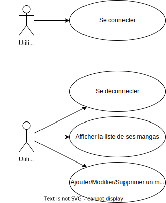

| Allemann Jonas | Cahier des charges projet JEE/Spring | 01.11.2022 |
| -------------- | ------------------------------------ | ---------- |

# Contexte

Ce projet s'inscrit dans le cadre du cours de "JEE/Spring" de la HE-Arc Ingénierie en informatique, 3ème année.

Le but du projet est de réaliser un petit site web en appliquant les concepts de Spring MVC vus en cours. Le sujet est libre.

Ce projet est à réaliser seul, en une dizaine d'heures.

## Projet
L'idée du projet retenu consiste à réaliser un site pour le suivi de lecture de ses mangas. De cette manière, le lecteur à la possibilité de savoir où il en est dans ses achats, se souvenir du dernier tome lut, etc.

Sur le site, il sera possible de saisir le nom du manga, le nombre de tomes déjà sortis/achetés, le nombre de tomes que l'on a déjà lu, et on peut laisser un commentaire sur le manga.

Le site s'étendrait naturellement à d'autres types de médias (livres, films, séries, etc.).

Afin de mettre à disposition ce site à plusieurs utilisateurs, un système de login sera mis en place de manière à pouvoir sauvegarder les informations de chaque utilisateur.

# Planning

Date | Durée | Tâche
--- | --- | ---
24.10.2020 | - | Explication du type de projet à réaliser
08.11.2022 | 1h30 | Remise du cahier des charges
14.11.2022|1h30| Mise en place de la structure du projet
21.11.2022|1h30| Page de connexion
28.11.2022|1h30| Page d'affichage de ses mangas
05.12.2022|1h30| Page d'ajout d'un manga
12.12.2022|1h30| Page d'édition d'un manga
19.12.2022|1h30| Design/Finitions du site
En parallèle des autres éléments | - | Tests unitaires Documentation
16.01.2023 | - | Remise du projet

# Fonctionnalités & Use case
Les fonctionnalités à implémenter sont les suivantes:

<Table>
<td>

* Mangas : Ajout, modification, suppression
* Utilisateur : create read update un manga dans sa liste
* La liste des mangas enregistrés sur le site est partagée pour tous
* Les informations telles que les achats ou l'avancée de lecture sont visibles et modifiables que par l'utilisateur qui les a enregistrés

</td>
<td>

</td>
</table>

## Priorités
Compte tenu de la taille du projet, les fonctionnalités suivantes sont prioritaires :
- Connexion de l'utilisateur
- Ajout/édition d'un manga
- Opérations CRUD sur les données d'un mangas pour un utilisateur

Les utilisateurs n'auront pas la possibilité de créer de comptes manuellement, ils seront hardcodés.
De même pour les données telles que les "types" ou "catégories".
Cependant ces éléments pourraient devenir modifiables dans une version ultérieure.

# Architecture
## Données

Les différentes données qui seront disponibles ainsi que leur structure dans la base de données sont les suivantes :

> - Afin d'anticiper l'évolution, la table `Media` représente n'importe quel type de média (livre, manga, film, série, etc.).
> - `Type` permet de mentionner le type de média (livre, manga, etc.)
> - `Category` permet de spécifier s'il s'agit de l'histoire principale, un spin-off, etc.

  
## Routes

> La redirection * est utilisée pour indiquer qu'il y a redirection vers la page de connexion (/login) si l'utilisateur n'est pas connecté.

| Description                                    | Route                | Contrôleur     | Méthode | Redirection |
| ---------------------------------------------- | -------------------- | --------------- | ------- | ----------- |
| Page d'accueil                                 | `/`                  | IndexController | Get     | -           |
| Page de connexion                              | `/login`             | AuthController  | Get     | -           |
| Connexion de l'utilisateur                     | `/login`             | AuthController  | Post    | `/`         |
| Déconnexion                                    | `/logout`            | AuthController  | Get     | `/`         |
| Page avec la liste des médias de l'utilisateur | `/media`             | MediaController | Get     | `*`         |
| Page d'ajout d'un média                        | `/media/add`         | MediaController | Get     | `*`         |
| Validation de l'ajout d'un média               | `/media/add`         | MediaController | Post    | `*`         |
| Page d'édition d'un média                      | `/media/edit/{id}`   | MediaController | Get     | `*`         |
| Validation de l'édition d'un média             | `/media/edit/{id}`   | MediaController | Post    | `*`         |
| Suppression d'un média                         | `/media/delete/{id}` | MediaController | Get     | `*`         |

## Maquettes

